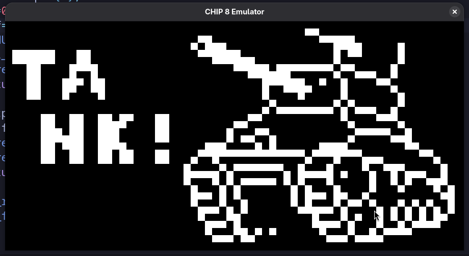
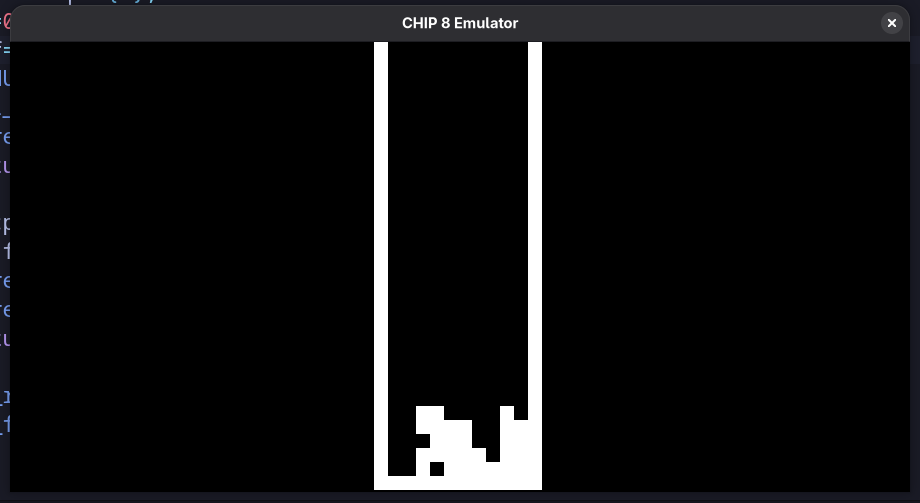

# Chip-8 Emulator

**Chip-8 emulator** written in C using **SDL3**, capable of running classic Chip-8 games. This emulator implements the Chip-8 instruction set, including timers, keypad input, and sprite-based graphics.

---

## Features

- **Full Chip-8 instruction set** implemented.
- **SDL3-based rendering** for smooth graphics.
- **Keyboard input** mapped to Chip-8 hex keypad.
- **Delay and sound timers** for accurate timing.

---

## Screenshots

  

---

## Getting Started

### Requirements

- **C compiler** (GCC, Clang, etc.)
- **SDL3 development libraries**
- Make or build system (optional)

### Building

- clear instructions commented in main.c preferebly use gcc with appropriate flags (also commented).

### Notes

- The audio implementation can further be devoleped, removed a printf("/a") which was used previously
- any PRs to improve audio are acknoledged
- The ROMs are from the chip8 archive which is open source

